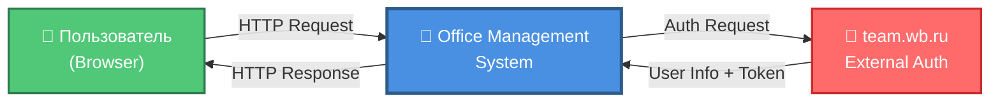
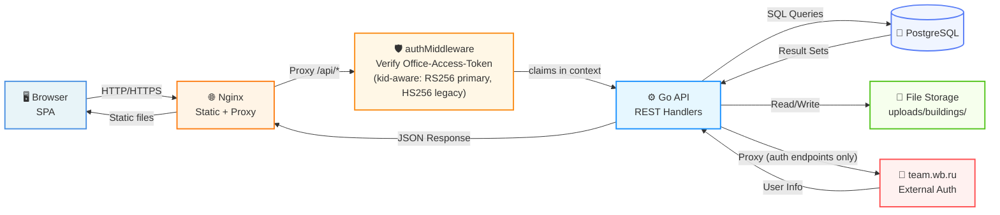
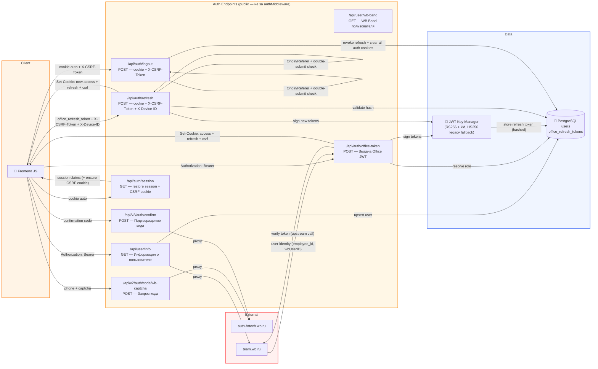
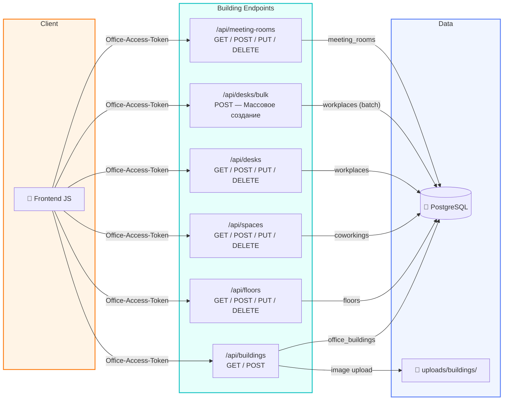
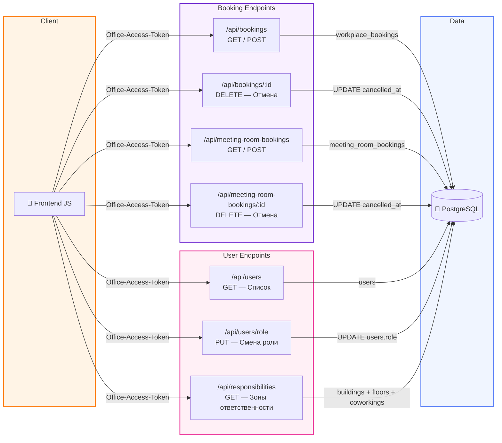
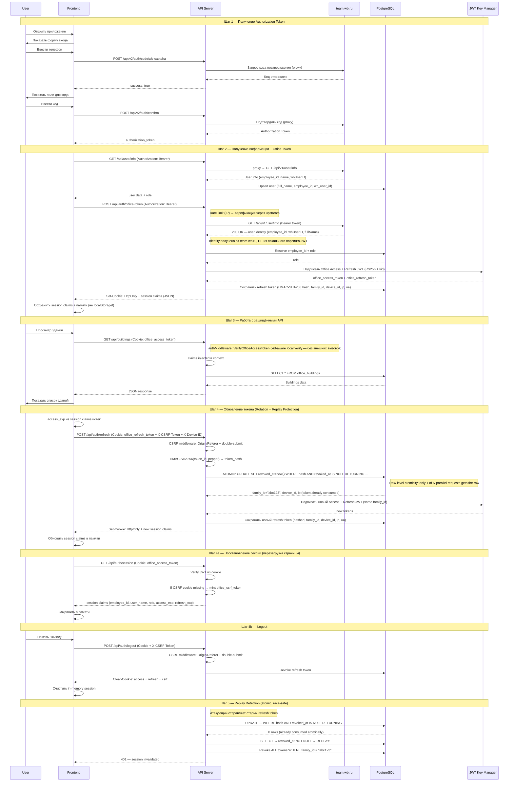
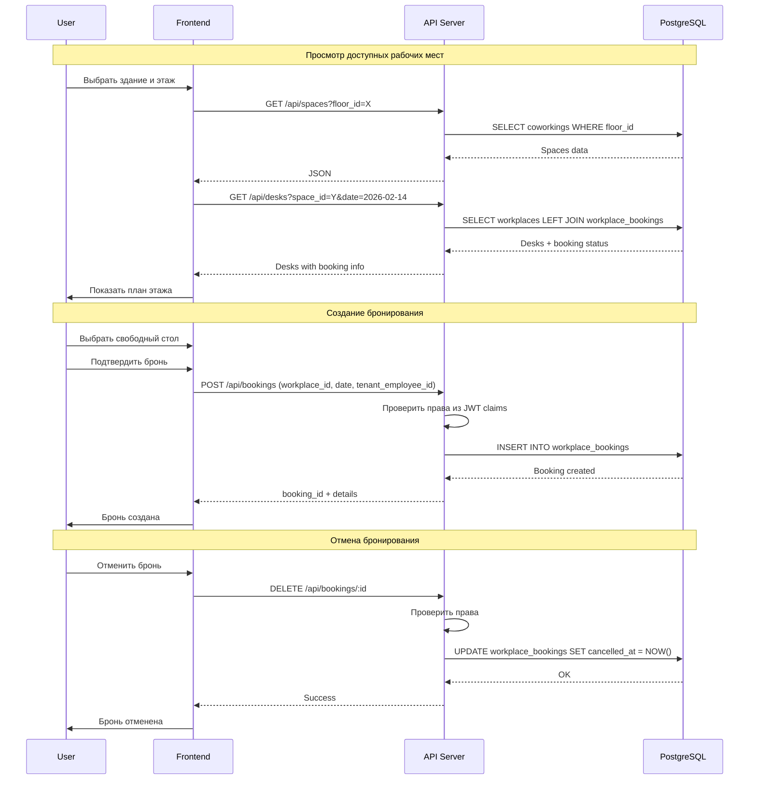
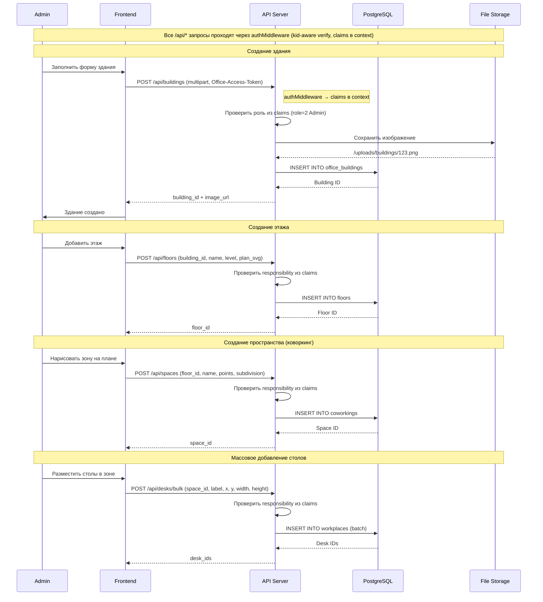
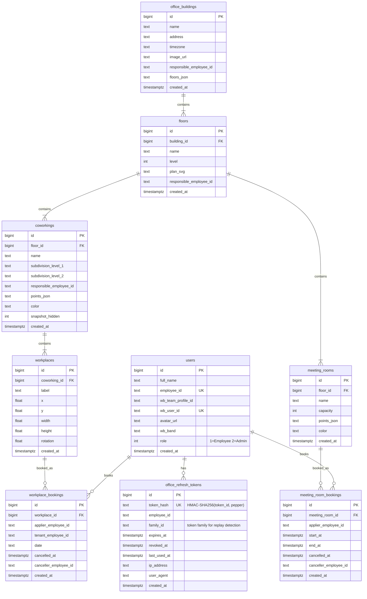

# Data Flow Diagram — Office Management System

## Контекстная диаграмма (Level 0)

---

## Детализированная диаграмма (Level 1)

---

## API Endpoints (Level 2 — Auth)

---

## API Endpoints (Level 2 — Buildings & Spaces)

---

## API Endpoints (Level 2 — Bookings & Users)

---

## Сценарий аутентификации (Auth Flow)

---

## Сценарий бронирования рабочих мест (Booking Flow)

---

## Сценарий управления зданиями (Building Management)

---

## Структура базы данных (ER-диаграмма)

---

## Основные потоки данных

### 1. Аутентификация
- **Вход:** User → Frontend → API → auth-hrtech.wb.ru (код) → team.wb.ru (user info)
- **Выдача office-токенов:** Frontend → API `/api/auth/office-token` → **upstream verification** (team.wb.ru/api/v1/user/info) → resolve role → JWT Handler → **HttpOnly cookies** (access + refresh) + session claims (JSON, convenience-only) → Frontend (in-memory)
- **Восстановление сессии:** Frontend → `GET /api/auth/session` → validate access cookie → session claims → Frontend (in-memory)
- **Обновление:** Frontend → API `/api/auth/refresh` (cookie + `X-CSRF-Token` + `X-Device-ID`) → **CSRF middleware** (`Origin/Referer` + double-submit) → hash token_id → **atomic consume** (UPDATE…RETURNING, race-safe) → **device_id check** → issue new pair (same family_id) → новые cookies (access + refresh + csrf)
- **Sliding expiration (по активности):** авто-refresh запускается только при недавней активности пользователя; idle-сессия не продлевается бесконечно
- **Выход:** Frontend → `POST /api/auth/logout` (`X-CSRF-Token`) → **CSRF middleware** → revoke refresh in DB → clear cookies (access + refresh + csrf)
- **Replay protection:** повторный revoked refresh → `revokeTokenFamily(family_id)` → 401 для всей цепочки
- **Device binding:** refresh привязан к `device_id`; несовпадение → revoke family → 401
- **IP/UA:** audit-only — логируются для forensics, **не блокируют** (VPN, NAT, mobile)
- **Rate limiting:** `/api/auth/office-token` и login-эндпоинты защищены IP rate limiter
- **XSS-защита:** токены в HttpOnly cookies — JS не имеет доступа к raw JWT
- **CSRF-защита:** double-submit cookie (`office_csrf_token` + `X-CSRF-Token`) + `Origin/Referer` check + SameSite=Strict (по умолчанию; конфигурируется)

### 2. Управление зданиями (CRUD)
- **Чтение:** Frontend → API → PostgreSQL → JSON → Frontend
- **Создание:** Frontend → API (multipart) → File Storage + PostgreSQL → Frontend
- **Проверка прав:** authMiddleware → claims в context (`employee_id`, `role`) → handler проверяет роль из JWT и ответственность в БД по `employee_id`

### 3. Бронирование рабочих мест
- **Просмотр:** Frontend → API → `workplaces LEFT JOIN workplace_bookings` → Frontend
- **Создание:** Frontend → API → `INSERT INTO workplace_bookings` → Frontend
- **Отмена:** Frontend → API → `UPDATE cancelled_at = NOW()` → Frontend (Soft Delete)

### 4. Бронирование переговорных
- **Просмотр:** Frontend → API → `meeting_room_bookings WHERE end_at > NOW()` → Frontend
- **Создание:** Frontend → API → проверка пересечений → `INSERT INTO meeting_room_bookings`
- **Отмена:** Frontend → API → `UPDATE cancelled_at = NOW()`

### 5. Управление пользователями
- **Роли:** Admin → API → `UPDATE users SET role` (1=Employee, 2=Admin)
- **Responsibilities:** через `responsible_employee_id` в таблицах buildings, floors, coworkings → проверяются в БД при изменяющих операциях

### 6. Файловое хранилище
- **Загрузка:** Frontend → API → `/uploads/buildings/` (local FS)
- **Отдача:** Browser → Nginx `/uploads/*` → File System

---

## Технологический стек

| Компонент | Технология |
|-----------|------------|
| **Frontend** | Vanilla JavaScript, HTML5, CSS3, Vite |
| **Backend** | Go 1.21+, net/http, pgx driver |
| **Database** | PostgreSQL 16 Alpine |
| **Auth** | JWT RS256 + kid (custom, HS256 legacy fallback), team.wb.ru API |
| **File Storage** | Local filesystem (`uploads/`) |
| **Web Server** | Nginx (prod), Go http.FileServer (dev) |
| **Containerization** | Docker, Docker Compose |
| **API Style** | REST JSON |

---

## Безопасность

1. **Двухуровневая аутентификация**
   - Authorization Token (внешний, от team.wb.ru / auth-hrtech.wb.ru)
   - Office-Access-Token (внутренний JWT, TTL по умолчанию 10 минут; конфиг `OFFICE_ACCESS_TTL_MINUTES`, clamp 5..10)
   - Office-Refresh-Token (TTL по умолчанию 30 дней; конфиг `OFFICE_REFRESH_TTL_DAYS`, clamp 7..30; ротация при каждом обновлении)
   - **Upstream token verification** — `/api/auth/office-token` **не доверяет** локально-декодированным JWT claims; вместо этого вызывает `team.wb.ru/api/v1/user/info` для подтверждения identity. Signing key внешнего токена нам недоступен, поэтому upstream-валидация — единственный надёжный способ.
   - **Rate limiting** — `/api/auth/office-token` защищён IP rate limiter (как login-эндпоинты)
   - **Key management** — Office JWT подписываются RS256 с `kid`; активный ключ выбирается через `OFFICE_JWT_ACTIVE_KID`, верификация выполняется по key ring (`OFFICE_JWT_PUBLIC_KEYS_JSON`), legacy HS256 токены поддерживаются на период миграции
   - **Token hashing** — token_id хранится как HMAC-SHA256(token_id, pepper), не в открытом виде; pepper задаётся отдельно (`OFFICE_REFRESH_PEPPER`, fallback на `OFFICE_JWT_SECRET`)
   - **Token families** — family_id связывает цепочку ротации для replay detection
   - **Фактические JWT claims (по коду):**
     - Access JWT: `employee_id`, `user_name`, `role`, `exp`, `iat`
     - Refresh JWT: `employee_id`, `token_id`, `family_id`, `exp`, `iat`
   - **Replay protection** — повторное использование revoked refresh → инвалидация всей семьи токенов; **atomic consume** (UPDATE…RETURNING) исключает race condition при параллельных refresh
   - **Audit fields** — last_used_at, ip_address, user_agent в каждом refresh token

2. **Middleware цепочка** (оборачивает весь mux — невозможно «забыть» проверку)
   - loggingMiddleware
   - securityHeadersMiddleware (X-Content-Type-Options, X-Frame-Options, CSP, HSTS)
   - corsMiddleware (whitelist origins)
   - csrfProtectionMiddleware (unsafe `/api/*`: Origin/Referer + double-submit)
   - **authMiddleware** — проверяет Office-Access-Token (kid-aware local verify: RS256 primary, HS256 legacy fallback) для всех `/api/*` кроме public paths; инжектирует claims в request context

3. **Контроль доступа**
   - Роли: Employee (1), Admin (2)
   - Responsibilities не хранятся в JWT; проверка выполняется по БД (`responsible_employee_id`) с `employee_id` из access claims
   - Rate limiting на auth endpoints + office-token (10 req/min per IP)

4. **Защита данных**
   - Параметризованные SQL-запросы (pgx)
   - Валидация входных данных
   - HTTPS в production
   - Statement timeout (30 сек)
   - MaxBytesReader для загрузок (5 MB)

---

## Особенности архитектуры

1. **Stateless API** — в JWT хранятся минимальные claims для авторизации, без массивов responsibilities
2. **Graceful Shutdown** — корректное завершение при SIGTERM/SIGINT
3. **Health Check** — `GET /api/health` для мониторинга
4. **Auto Migrations** — автоматическое применение миграций при старте сервера
5. **Connection Pooling** — настроенный пул соединений к PostgreSQL
6. **Timezone Support** — каждое здание имеет свою временную зону
7. **Soft Delete** — бронирования отменяются через `cancelled_at`, не удаляются
8. **Token Rotation + Replay Detection** — при обновлении refresh token старый отзывается (revoked_at + last_used_at) **атомарно** через `UPDATE … RETURNING` (защита от race condition параллельных запросов), выдаётся новый с тем же family_id; повторное использование revoked token → инвалидация всего семейства

---

**Дата создания:** 2026-02-13
**Обновлено:** 2026-02-16
**Версия:** 2.5 — RS256+kid key management + DFD sync
