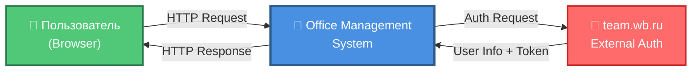
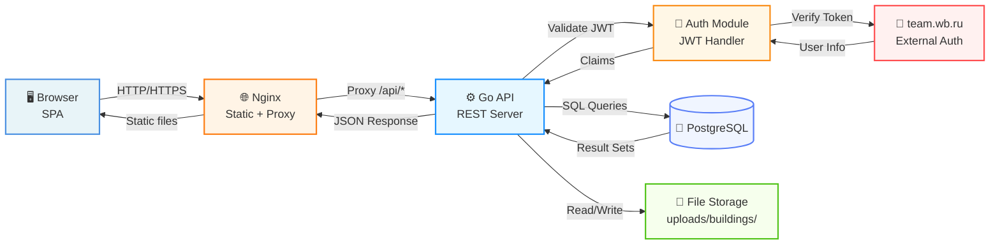
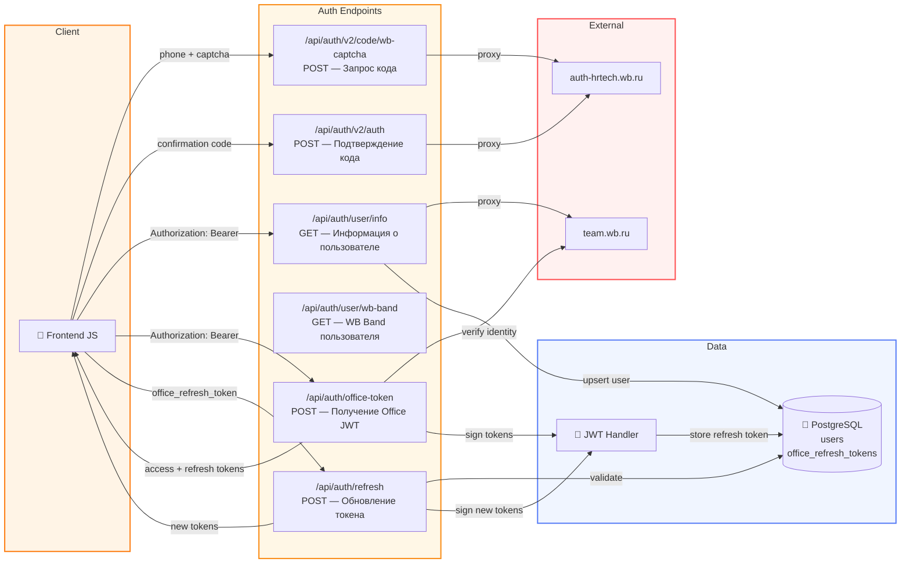
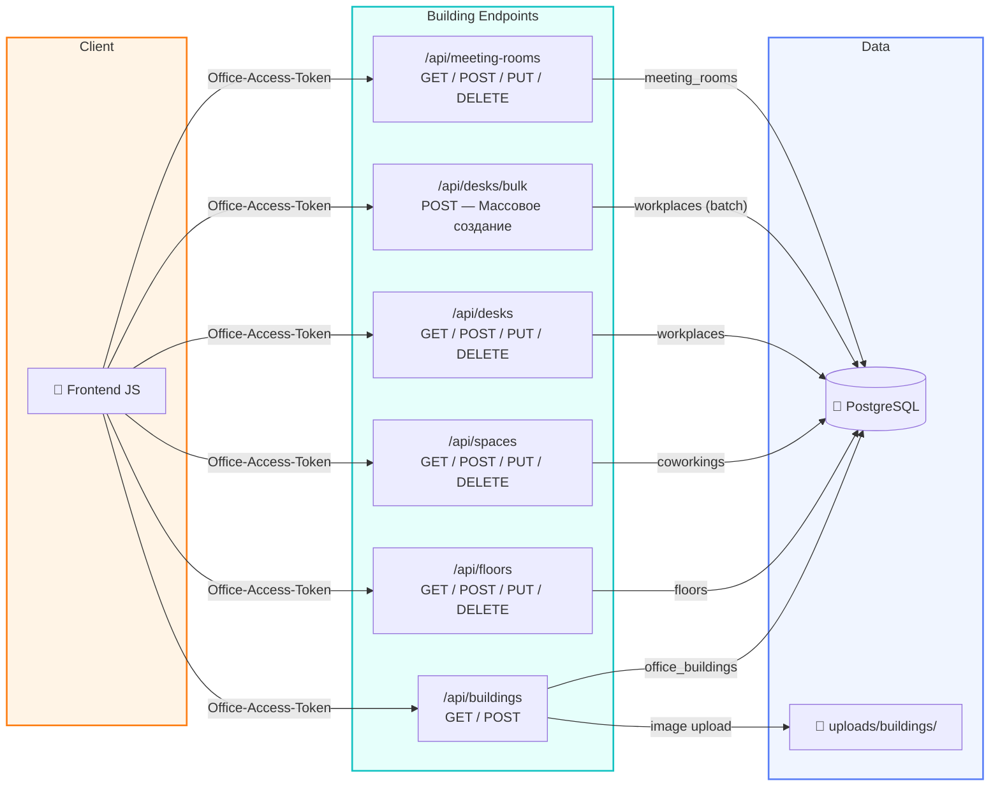
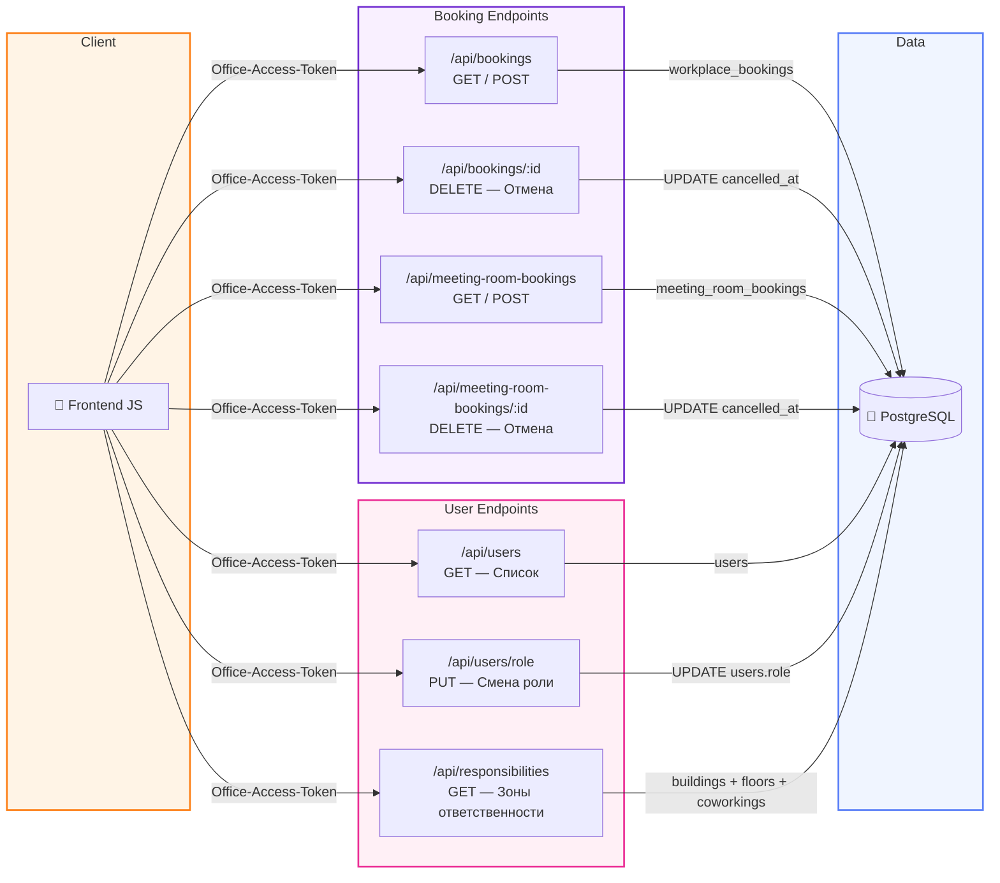
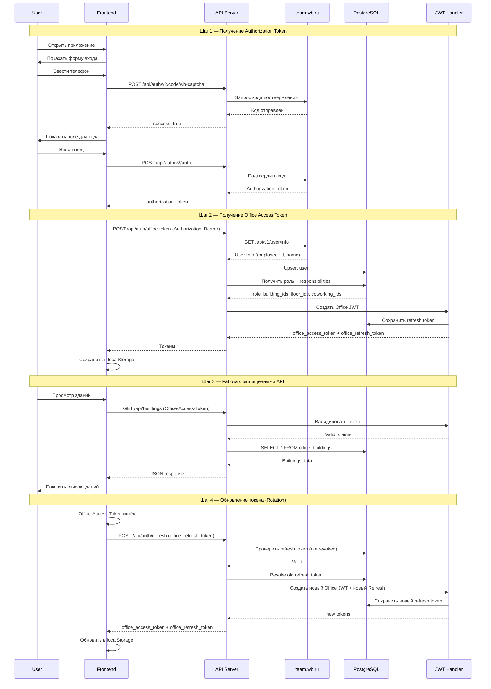
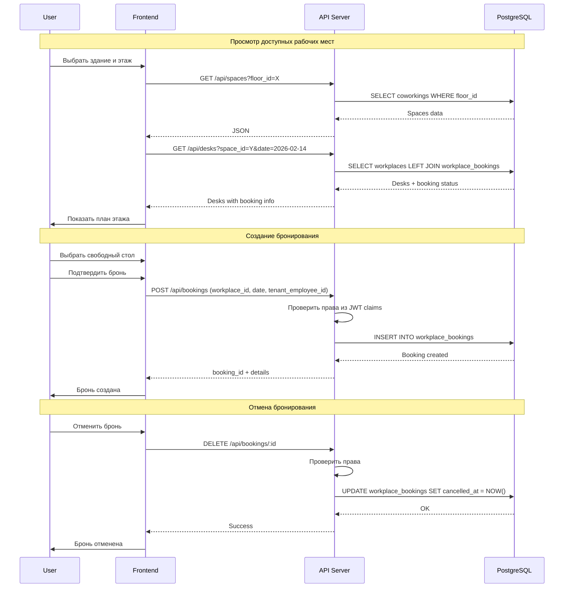
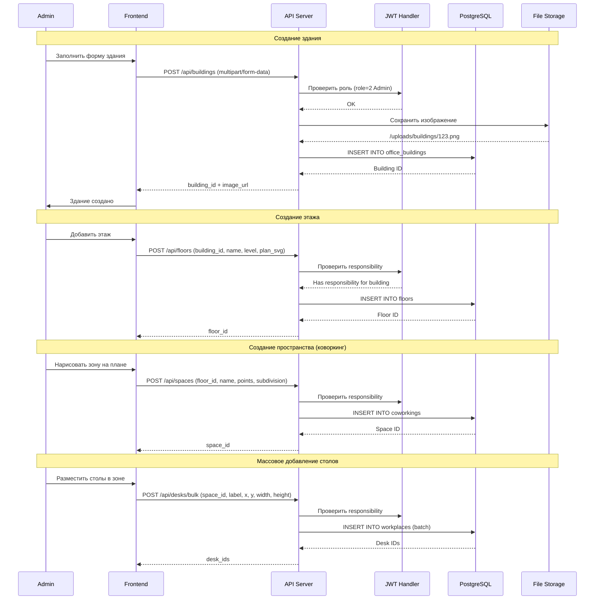
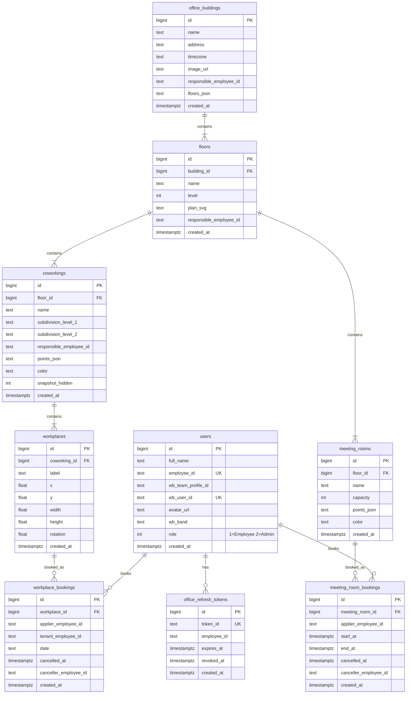

# Data Flow Diagram — Office Management System

## Контекстная диаграмма (Level 0)

---

## Детализированная диаграмма (Level 1)

---

## API Endpoints (Level 2 — Auth)

---

## API Endpoints (Level 2 — Buildings & Spaces)

---

## API Endpoints (Level 2 — Bookings & Users)

---

## Сценарий аутентификации (Auth Flow)

---

## Сценарий бронирования рабочих мест (Booking Flow)

---

## Сценарий управления зданиями (Building Management)

---

## Структура базы данных (ER-диаграмма)

---

## Основные потоки данных

### 1. Аутентификация
- **Вход:** User → Frontend → API → auth-hrtech.wb.ru (код) → team.wb.ru (user info)
- **Выход:** API → JWT Handler → `office_access_token` + `office_refresh_token` → Frontend (localStorage)
- **Обновление:** Frontend → API `/api/auth/refresh` → revoke old token → issue new pair

### 2. Управление зданиями (CRUD)
- **Чтение:** Frontend → API → PostgreSQL → JSON → Frontend
- **Создание:** Frontend → API (multipart) → File Storage + PostgreSQL → Frontend
- **Проверка прав:** JWT claims (`role`, `responsibilities`) → Middleware

### 3. Бронирование рабочих мест
- **Просмотр:** Frontend → API → `workplaces LEFT JOIN workplace_bookings` → Frontend
- **Создание:** Frontend → API → `INSERT INTO workplace_bookings` → Frontend
- **Отмена:** Frontend → API → `UPDATE cancelled_at = NOW()` → Frontend (Soft Delete)

### 4. Бронирование переговорных
- **Просмотр:** Frontend → API → `meeting_room_bookings WHERE end_at > NOW()` → Frontend
- **Создание:** Frontend → API → проверка пересечений → `INSERT INTO meeting_room_bookings`
- **Отмена:** Frontend → API → `UPDATE cancelled_at = NOW()`

### 5. Управление пользователями
- **Роли:** Admin → API → `UPDATE users SET role` (1=Employee, 2=Admin)
- **Responsibilities:** через `responsible_employee_id` в таблицах buildings, floors, coworkings → включаются в JWT

### 6. Файловое хранилище
- **Загрузка:** Frontend → API → `/uploads/buildings/` (local FS)
- **Отдача:** Browser → Nginx `/uploads/*` → File System

---

## Технологический стек

| Компонент | Технология |
|-----------|------------|
| **Frontend** | Vanilla JavaScript, HTML5, CSS3, Vite |
| **Backend** | Go 1.21+, net/http, pgx driver |
| **Database** | PostgreSQL 16 Alpine |
| **Auth** | JWT HS256 (custom), team.wb.ru API |
| **File Storage** | Local filesystem (`uploads/`) |
| **Web Server** | Nginx (prod), Go http.FileServer (dev) |
| **Containerization** | Docker, Docker Compose |
| **API Style** | REST JSON |

---

## Безопасность

1. **Двухуровневая аутентификация**
   - Authorization Token (внешний, от team.wb.ru / auth-hrtech.wb.ru)
   - Office-Access-Token (внутренний JWT, TTL 1 час)
   - Office-Refresh-Token (TTL 30 дней, ротация при каждом обновлении)

2. **Middleware цепочка**
   - CORS (whitelist origins)
   - Security Headers (X-Content-Type-Options, X-Frame-Options, CSP, HSTS)
   - Logging
   - JWT Validation (Office-Access-Token)

3. **Контроль доступа**
   - Роли: Employee (1), Admin (2)
   - Responsibilities в JWT: `building_ids`, `floor_ids`, `coworking_ids`
   - Rate limiting на auth endpoints (10 req/min per IP)

4. **Защита данных**
   - Параметризованные SQL-запросы (pgx)
   - Валидация входных данных
   - HTTPS в production
   - Statement timeout (30 сек)
   - MaxBytesReader для загрузок (5 MB)

---

## Особенности архитектуры

1. **Stateless API** — вся информация о пользователе хранится в JWT-токене
2. **Graceful Shutdown** — корректное завершение при SIGTERM/SIGINT
3. **Health Check** — `GET /api/health` для мониторинга
4. **Auto Migrations** — автоматическое применение миграций при старте сервера
5. **Connection Pooling** — настроенный пул соединений к PostgreSQL
6. **Timezone Support** — каждое здание имеет свою временную зону
7. **Soft Delete** — бронирования отменяются через `cancelled_at`, не удаляются
8. **Token Rotation** — при обновлении refresh token старый отзывается, выдаётся новый

---

**Дата создания:** 2026-02-13
**Обновлено:** 2026-02-15
**Версия:** 2.0
